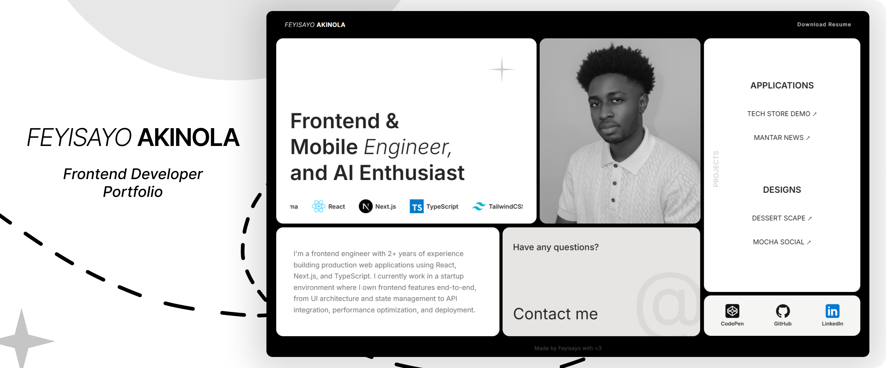

## Try it out
[🚀 Live Preview](https://feyi-theta.vercel.app/)

<div align="center">
  <a href="https://feyi-theta.vercel.app/" alt="Portfolio" target="_blank">
    
  </a>
  
  <h2 align="center">Feyisayo Akinola – Portfolio</h2>

  <p align="center">
    A high-fidelity, motion-driven digital garden.<br/>
    Built with React 19, Vite, and TypeScript to showcase software engineering projects through an intricate, math-powered Bento experience.
  </p>

  <p>
    
    
    
    
    
  </p>
</div>


## Overview

This project transcends standard static portfolios by treating the UI as a physical space. Every interaction is calculated to feel weighted, organic, and responsive.

### 💎 Key Engineering Features
- **Dynamic Bento Architecture**: A sophisticated grid system that transitions from a single-column mobile stack to a 3-column Tablet Bento, culminating in a custom-ratio 4-column Desktop layout.
- **Motion Orchestration**: Implemented **Linear Interpolation (LERP)** and `requestAnimationFrame` to decouple mouse movement from UI updates, creating "weighted" cursor-following effects.
- **3D Perspective Engine**: A custom `TiltCard` system using CSS `perspective(700px)` and dynamic quaternionic rotations based on real-time cursor coordinates.
- **Collision & Clamping Logic**: Advanced viewport-aware math ensures that floating project previews are clamped within screen boundaries, preventing UI overflow.
- **Tactile UX**: Interactive "Click-to-Copy" email system with immediate state-aware tooltip feedback and success-state styling.


## Tech Stack

- **Core**: React 19 (leveraging the new React Compiler)
- **Build Tooling**: Vite 7 for lightning-fast HMR
- **Type Safety**: TypeScript 5 (Strict Mode)
- **Styling**: Tailwind CSS 4 (utilizing modern JIT engine)
- **Animation**: Custom Hooks + CSS Keyframes + RAF Loops


## Project Structure

```txt
src/
├── components/
│   ├── TiltCard.tsx      # 3D Perspective wrapper logic
│   ├── HeroCard.tsx      # Typewriter + Infinite skill scroller
│   ├── ProjectsCard.tsx  # LERP-based hover previews & Clamping math
│   ├── ContactCard.tsx   # Clipboard API + Adaptive tooltips
│   ├── BioCard.tsx       # Simple bio description
│   ├── NavBar.tsx        # Name + Resume download
│   └── PhotoCard.tsx     # Dynamic grayscale filtering
├── hooks/
│   └── useTypewriter.ts  # Logic for the custom hero text effect
└── App.tsx               # Grid orchestration & Responsive tracks
```


## Getting Started

### Prerequisites
- Node.js v18+
- npm (or a compatible package manager)

### Install dependencies

```bash
npm install
```

### Run the app in development

```bash
npm run dev
# http://localhost:5173
```

### Build and preview

```bash
npm run build
npm run preview
```


## Available Scripts

- `npm run dev`: Start the Vite dev server.
- `npm run build`: Type-check (via `tsc -b`) and create a production build.
- `npm run preview`: Preview the production build locally.
- `npm run lint`: Run ESLint over the codebase.


## License

No license has been specified for this project.